  

  

  

  <a href="https://github.com/huaruic/huaruic/issues/new?title=ask%3A%20"><b>Ask my agent something</b></a>

### Recently asked

<!-- ASK:START -->
Nobody has asked anything yet.
<!-- ASK:END -->

## Projects

### AI

- [CatClaw](https://catclaw.app): the OpenClaw agent as a Mac app
- [ClawSetup](https://clawsetup.netlify.app): one-click OpenClaw installer for macOS
- [Xingqiao 星桥](https://xingqiaosub.com): ChatGPT and Claude subscriptions for mainland China
- [huaruic/skills](https://github.com/huaruic/skills): my Claude Code and Codex skills
- [hermes-claude](https://github.com/huaruic/hermes-claude): routing rules and guardrails for coding agents
- [According.Work](https://according.work): developer collaboration platform I co-founded
- [Open Memory](https://github.com/memory-orb): local-first memory for your AI chats
- [CleanCut](https://github.com/huaruic/cleancut): speech cleanup pipeline

### Web3

- [ZamaDrop](https://zamadrop.xyz): encrypted airdrops on Zama fhEVM
- [ZamaVote](https://zama-vote.vercel.app): encrypted ballots, public result
- [CoTrading](https://cotrading.ai): on-chain deposits and swaps on Base
- [GoHacker.ai](https://www.gohacker.ai): rewards for open-source contributors
- [ao-memory](https://github.com/huaruic/ao-memory): memory storage on AO

## Timeline

  

## Hackathons

  

  ernestchen247@gmail.com · <a href="https://x.com/0xErnest247">X</a> · <a href="https://t.me/ErnestAgent">Telegram</a> · <a href="https://huaruic.github.io">Blog</a>

